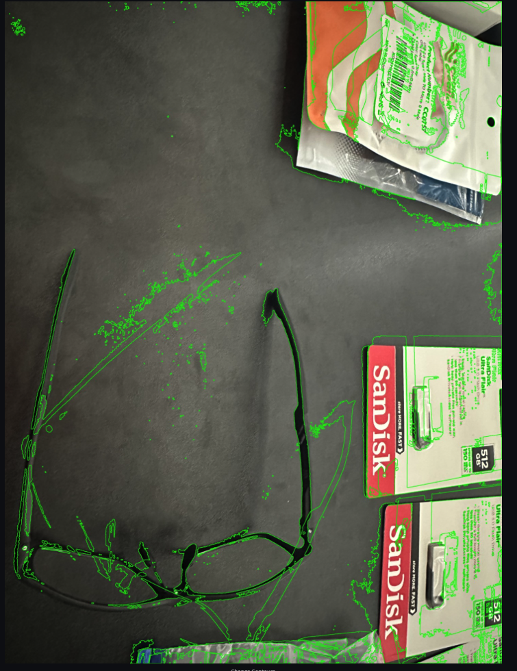
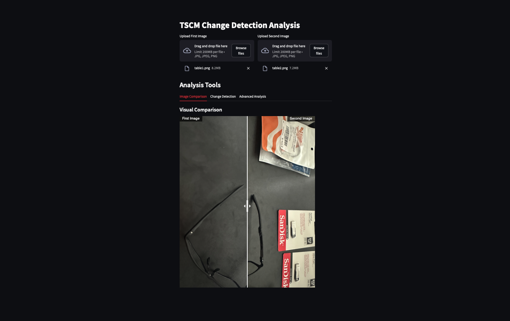
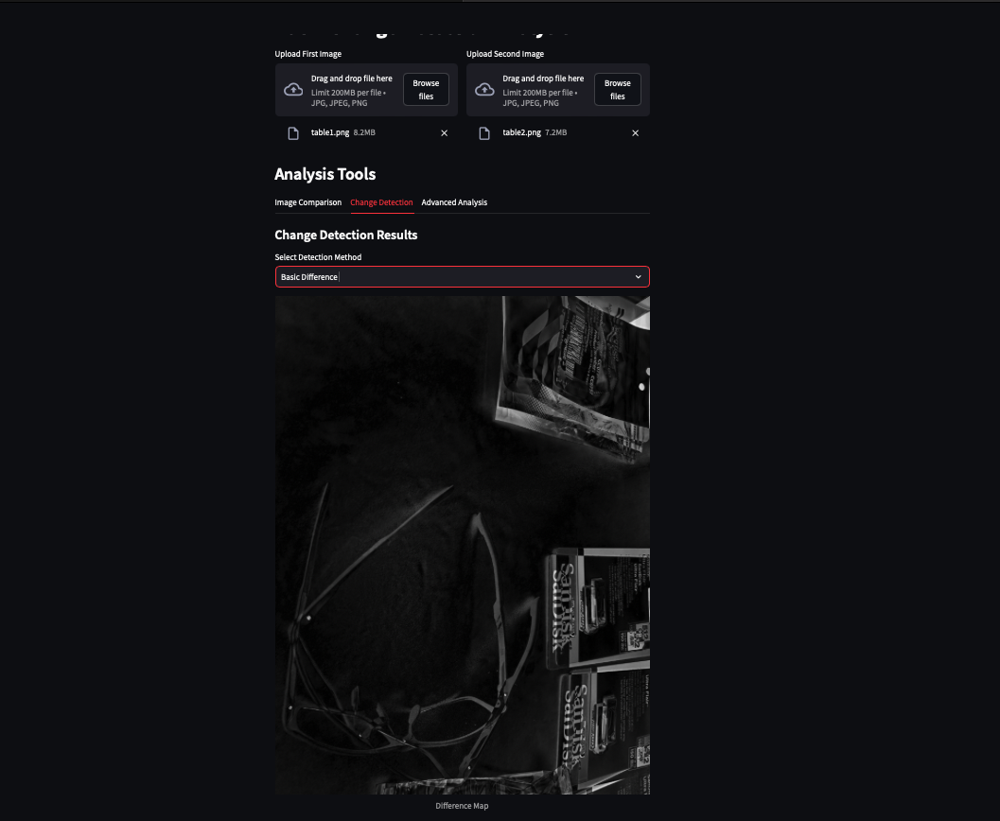
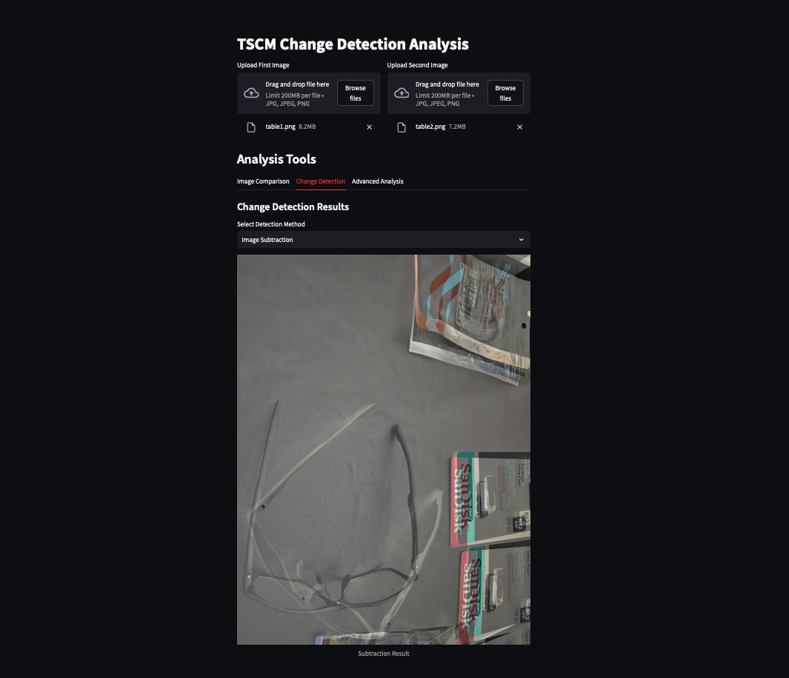
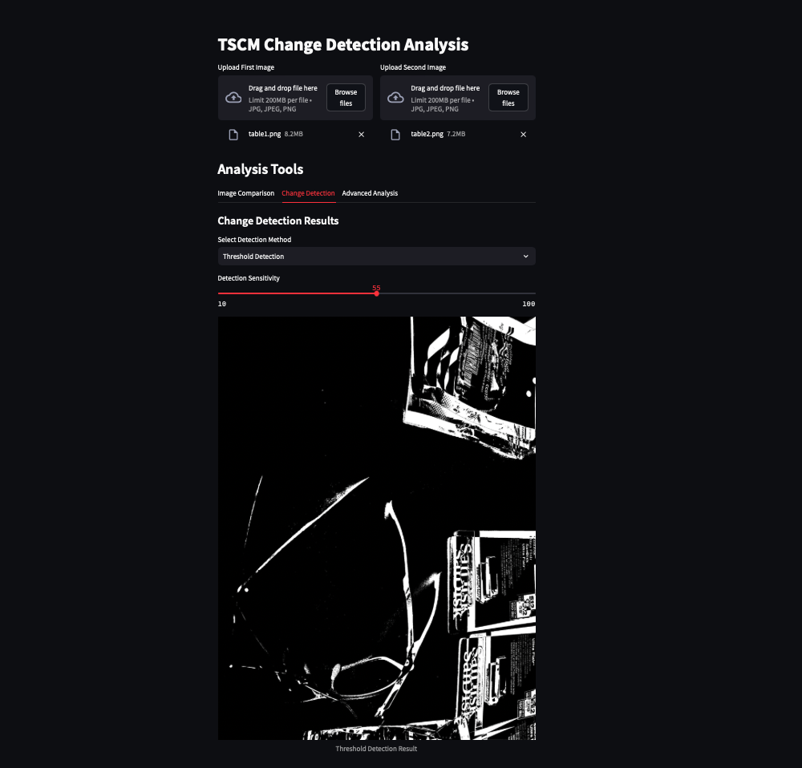
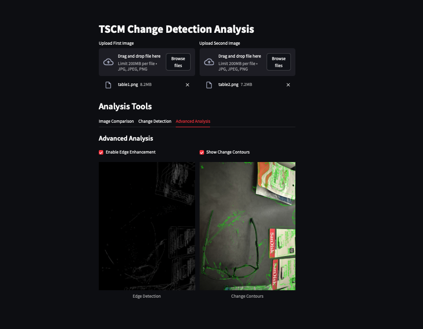

# TSCM Change Detection Analysis Tool

## Overview

This application is designed for Technical Surveillance Countermeasures (TSCM) professionals to analyze and detect changes between two images. It provides multiple analysis methods and visualization tools to identify potential modifications or anomalies in surveillance areas.



## Installation

### Prerequisites
- Python 3.8 or higher
- pip package manager

### Required Packages
```bash
pip install streamlit opencv-python numpy Pillow streamlit-image-comparison==0.0.4
```

### Running the Application
```bash
streamlit run app.py
```

## Features and Components

### 1. Image Loading (`load_image` function)
- Accepts various image formats (JPG, JPEG, PNG)
- Converts uploaded images to numpy arrays for processing
- Handles image preprocessing automatically



### 2. Core Analysis Methods

#### Basic Difference Detection (`compute_difference` function)
- Resizes images to match dimensions
- Converts images to grayscale for comparison
- Calculates absolute difference between images
- Applies threshold to highlight significant changes
- Includes noise reduction using morphological operations
- Returns both difference map and thresholded result



#### Image Subtraction (`apply_image_subtraction` function)
- Converts images to float32 for precise subtraction
- Performs pixel-by-pixel subtraction
- Normalizes results to visible range (0-255)
- Useful for detecting subtle changes



### 3. User Interface Components

#### Image Upload Section
- Dual file uploaders for before/after images
- Supports common image formats
- Side-by-side layout for easy comparison

#### Analysis Tools (Three Tabs)

##### Tab 1: Image Comparison
- Interactive slider comparison between images
- Side-by-side view with labels
- Real-time visual comparison capability

##### Tab 2: Change Detection
Three detection methods:
1. **Basic Difference**
   - Shows difference map and thresholded changes
   - Best for obvious physical changes

2. **Image Subtraction**
   - Displays subtle variations
   - Useful for detecting minor modifications

3. **Threshold Detection**
   - Adjustable sensitivity slider (10-100)
   - Customizable change detection threshold
   - Highlights changes based on sensitivity setting



##### Tab 3: Advanced Analysis
1. **Edge Enhancement**
   - Uses Canny edge detection
   - Highlights boundaries of changed areas
   - Useful for detecting structural modifications

2. **Change Contours**
   - Draws green contours around changed regions
   - Helps visualize the extent of changes
   - Useful for identifying specific areas of interest



## Best Practices for TSCM Analysis

1. **Image Capture**
   - Use consistent lighting conditions
   - Maintain same camera position and angle
   - Ensure images are clear and in focus

2. **Analysis Workflow**
   - Start with visual comparison
   - Use basic difference for initial screening
   - Apply threshold detection for detailed analysis
   - Confirm findings with advanced analysis tools

3. **Sensitivity Adjustment**
   - Start with default threshold (30)
   - Increase sensitivity for subtle changes
   - Decrease sensitivity to reduce false positives

## Troubleshooting

Common issues and solutions:
- **Image Size Mismatch**: Automatically handled by resize function
- **Memory Errors**: Reduce image size before upload
- **False Positives**: Adjust sensitivity threshold
- **Noise**: Use morphological operations for cleanup

## Technical Notes

- Images are processed in RGB and grayscale formats
- Contour detection uses external retrieval method
- Edge detection parameters: 100 (lower) and 200 (upper) thresholds
- Morphological kernel size: 5x5 pixels
