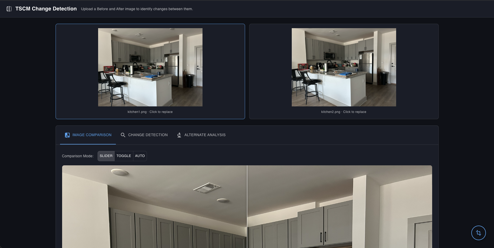
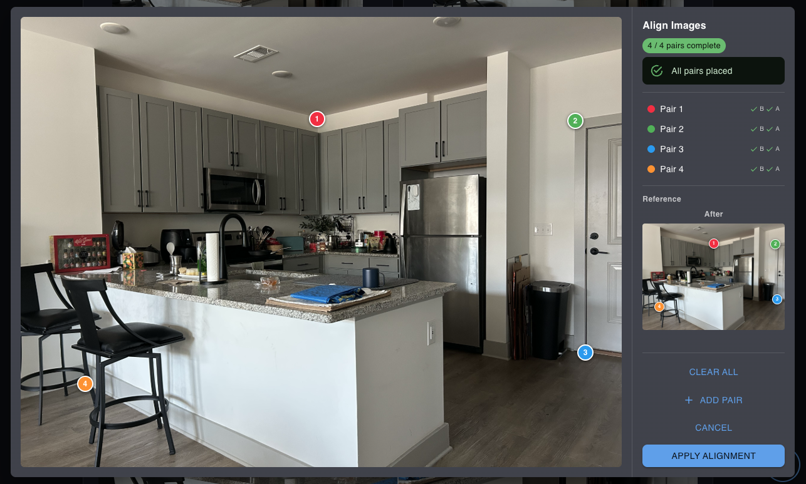
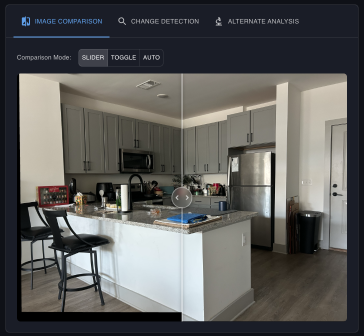
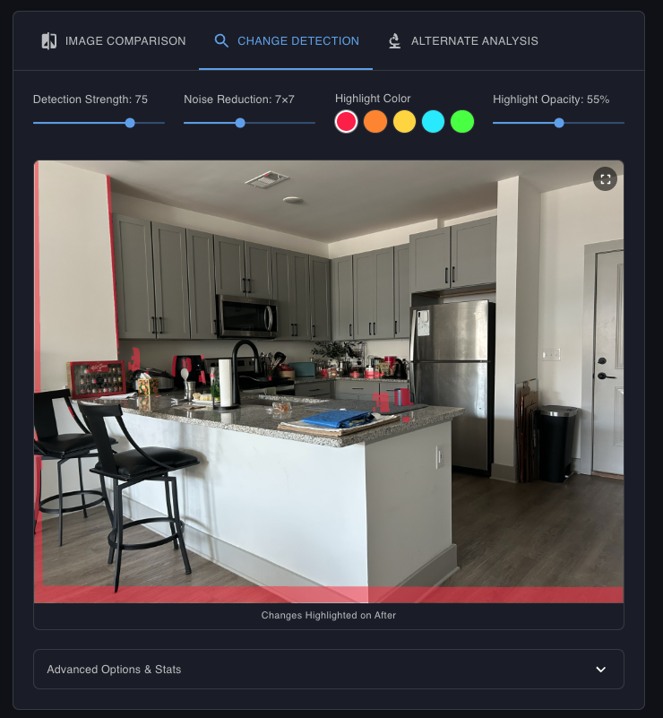
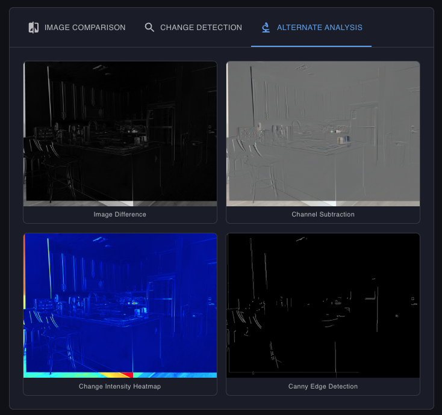

# TSCM Change Detection Analysis Tool

A web application for Technical Surveillance Countermeasures (TSCM) professionals to detect and analyze changes between two images. Upload a Before and After photo to identify potential modifications or anomalies in a surveillance area.

**Stack:** Go (Gin) backend · React 19 + TypeScript frontend · MUI · Pure-Go image processing (no OpenCV)



## Installation

Download the correct release archive for your platform from the [Releases](https://github.com/skinnyrad/tscm-change-detection/releases/latest) page. No runtime dependencies required — the binary is fully self-contained.

| Platform | Architecture | File |
|---|---|---|
| Linux | x86-64 (most desktops/servers) | `tscm-change-detection_vX.X.X_linux_amd64.tar.gz` |
| Linux | ARM64 (Raspberry Pi, ARM servers) | `tscm-change-detection_vX.X.X_linux_arm64.tar.gz` |
| macOS | Apple Silicon (M1/M2/M3) | `tscm-change-detection_vX.X.X_macos_arm64.tar.gz` |
| macOS | Intel | `tscm-change-detection_vX.X.X_macos_amd64.tar.gz` |
| Windows | x86-64 | `tscm-change-detection_vX.X.X_windows_amd64.tar.gz` |
| Windows | ARM64 | `tscm-change-detection_vX.X.X_windows_arm64.tar.gz` |

Note on macOS and Windows blocking unsigned binaries

The release binaries are not code-signed or notarized. On first run, modern macOS and Windows may block the executable. Use the steps below to allow the app to run.

### macOS

```bash
tar -xzf tscm-change-detection_vX.X.X_macos_arm64.tar.gz
```

If you are unsure which chip your Mac has, click the Apple menu → **About This Mac**. Use the `arm64` build for Apple Silicon (M1 or later) and `amd64` for Intel.

- If Finder prevents launching, clear the quarantine flag then run:

```bash
xattr -d com.apple.quarantine ./tscm-change-detection
./tscm-change-detection
```

- If macOS still blocks the app, open System Settings → Privacy & Security (or System Preferences → Security & Privacy) and click "Open Anyway" next to the blocked app message. Alternatively, Control-click the app and choose "Open" to bypass Gatekeeper for that app.

Open `http://localhost:8080` in your browser.

### Windows

```powershell
tar -xzf tscm-change-detection_vX.X.X_windows_amd64.tar.gz
.\tscm-change-detection.exe
```

If you are on an ARM device, use the `windows_arm64` archive instead.

- In PowerShell, unblock the file then run it:

```powershell
Unblock-File -Path .\tscm-change-detection.exe
.\tscm-change-detection.exe
```

- If Windows Defender SmartScreen warns: click "More info" then "Run anyway". You can also right-click the downloaded file, choose Properties, and check "Unblock" at the bottom of the General tab before running.

Open `http://localhost:8080` in your browser.

### Linux

```bash
tar -xzf tscm-change-detection_vX.X.X_linux_amd64.tar.gz
./tscm-change-detection
```

The binary ships with the executable bit already set. Open `http://localhost:8080` in your browser.

To make the binary available system-wide, move it to a directory on your `PATH`:

```bash
sudo mv tscm-change-detection /usr/local/bin/
```

## Building from source

**Prerequisites:** [Go 1.25+](https://go.dev/dl/) · [Bun](https://bun.sh)

1. Clone the repository:

   ```bash
   git clone https://github.com/skinnyrad/tscm-change-detection.git
   cd tscm-change-detection
   ```

2. Build the frontend:

   ```bash
   cd frontend && bun install && bun run build && cd ..
   ```

3. Build the Go binary (embeds the frontend at compile time):

   ```bash
   go build -o tscm-change-detection .
   ```

4. Run:

   ```bash
   ./tscm-change-detection
   ```

The app opens at `http://localhost:8080`.

## Usage

Upload a **Before** and **After** image using the two panels at the top. Previews appear immediately. If the images differ in size, the Before image is automatically resized to match the After image for analysis.

Once both images are uploaded, a **Transform button** (⇄) appears in the bottom-right corner. Click it to open the alignment dialog, where you can place up to 8 matching point pairs to perspective-warp the Before image onto the After image. This corrects for camera angle differences and reduces false positives. The button turns solid blue when an alignment is active.



## Analysis Tools

### Tab 1 — Image Comparison

Visually compare the two images side by side. Switch between three modes:

- **Slider** — drag a divider left/right to reveal Before or After; the handle can also be dragged vertically to inspect any part of the image
- **Toggle** — click `Before`, `After`, or `↔` to flip between full-resolution images instantly
- **Auto** — automatically flickers between Before and After at a speed controlled by the Speed slider (100 ms – 2 s per frame)



### Tab 2 — Change Detection

Displays a single result: the After image with detected changes highlighted in your chosen color. Results update automatically whenever any control is adjusted.

**Primary controls:**

- **Detection Strength (5–100, default 75)** — threshold sensitivity. Lower values flag subtle changes; higher values reduce false positives.
- **Noise Reduction (1–15, default 7×7)** — morphological opening kernel. Suppresses isolated noise pixels and compression artifacts before thresholding.
- **Highlight Color** — five preset swatches: Red, Orange, Yellow, Cyan, Lime.
- **Highlight Opacity (10–100%, default 55%)** — how strongly the highlight color overlays the After image.

**Advanced Options & Stats** (collapsed by default):

- **Min Region Size** — discard detected blobs smaller than this many pixels, eliminating tiny spurious detections.
- **Pre-blur (σ 0–4, default 2.0)** — Gaussian blur applied to both images before differencing. Smooths JPEG block artifacts and sub-pixel camera jitter. Set to 0 to disable.
- **Fill Gaps (1–15, default 5×5)** — morphological closing kernel applied after noise reduction. Fills interior holes in detected regions so real objects appear as solid blobs.
- **Normalize Lighting** — shifts each image's mean luminance to a common baseline before differencing, reducing false positives caused by global brightness changes between shots.
- **Stats** — Changed Area %, Changed Pixels, and Distinct Regions for the current result.



### Tab 3 — Alternate Analysis

Runs four simultaneous visualizations using the same underlying diff pipeline, useful for characterizing the nature and severity of detected changes. No configuration required — results appear automatically once both images are uploaded.

- **Image Difference** — raw grayscale difference map showing per-pixel change magnitude.
- **Channel Subtraction** — per-channel float subtraction (After − Before), normalized to 0–255. Preserves gradient information and color-channel asymmetry; useful for detecting subtle or gradual modifications.
- **Change Intensity Heatmap** — JET colormap overlay (blue = low change, red = high change). Useful for assessing the magnitude and spatial distribution of changes.
- **Canny Edge Detection** — edge detection run on the difference map, highlighting structural boundaries of changed regions.



## Best Practices

- Use consistent lighting, angle, and most importantly **lens position** between shots.
- If photos were taken from slightly different positions or angles, use the **alignment tool** (⇄ FAB) to mark 4–8 matching landmarks before running analysis — this significantly reduces geometric false positives.
- Enable **Normalize Lighting** when shots were taken under different ambient conditions.
- Increase **Pre-blur** if JPEG compression artifacts or minor camera shake are producing false positives along high-contrast edges.
- Use **Alternate Analysis** to cross-reference: the heatmap shows severity, the subtraction view reveals color-channel changes, and the edge map highlights structural boundaries.
- If getting too many false positives, decrease Detection Strength and/or increase Noise Reduction.
