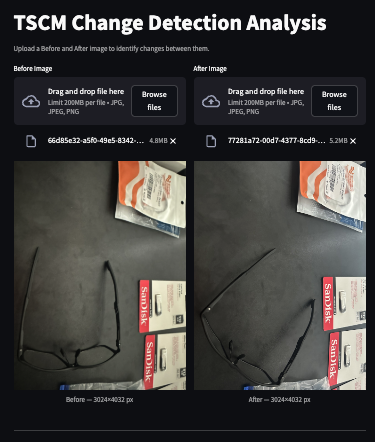
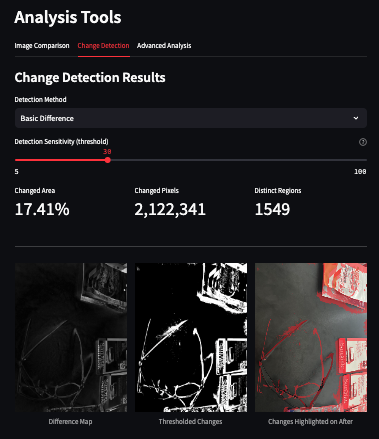
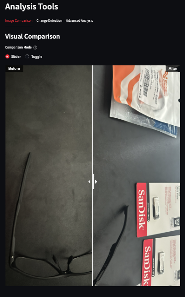
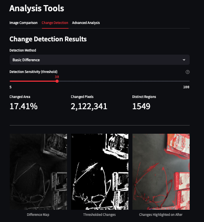
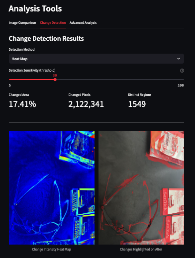
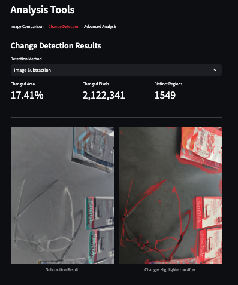
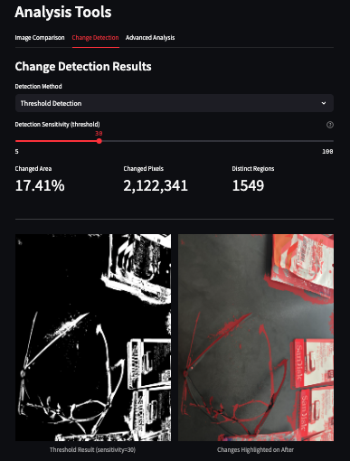
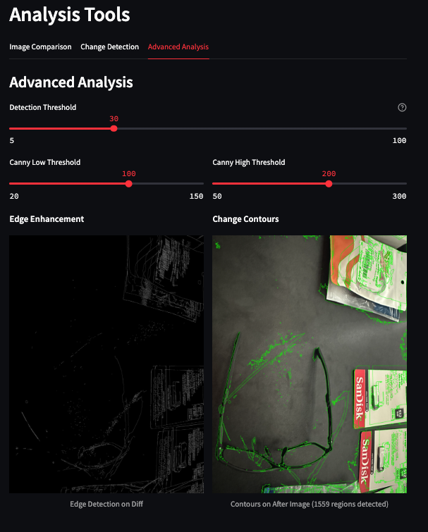

# TSCM Change Detection Analysis Tool

A web application for Technical Surveillance Countermeasures (TSCM) professionals to detect and analyze changes between two images. Upload a Before and After photo to identify potential modifications or anomalies in a surveillance area.

**Stack:** Go (Gin) backend · React 19 + TypeScript frontend · MUI · Pure-Go image processing (no OpenCV)






## Installation

### Option A — Run the pre-built binary

Download the latest release binary and run it directly. No runtime dependencies required.

```bash
./tscm-change-detection
```

The app opens at `http://localhost:8080`.

---

### Option B — Build from source

**Prerequisites:** [Go 1.25+](https://go.dev/dl/) · [Bun](https://bun.sh)

1. Clone the repository:

   ```bash
   git clone https://github.com/skinnyrad/tscm-change-detection.git
   cd tscm-change-detection
   ```

2. Build the frontend:

   ```bash
   cd frontend && bun install && bun run build && cd ..
   ```

3. Build the Go binary (embeds the frontend at compile time):

   ```bash
   go build -o tscm-change-detection .
   ```

4. Run:

   ```bash
   ./tscm-change-detection
   ```

The app opens at `http://localhost:8080`.

---

### Development mode

Run the backend and frontend separately with hot-reload:

```bash
# Terminal 1 — Go API on :8080
go run .

# Terminal 2 — React dev server on :3000 (proxies /api/* to Go)
cd frontend && bun --hot src/index.ts
```


## Usage

Upload a **Before** and **After** image using the two panels at the top. Previews appear immediately. If the images differ in size, the Before image is automatically resized to match the After image for analysis.

Once both images are uploaded, a **Transform button** (⇄) appears in the bottom-right corner. Click it to open the alignment dialog, where you can place up to 8 matching point pairs to perspective-warp the Before image onto the After image. This corrects for camera angle differences and reduces false positives. The button turns solid blue when an alignment is active.


## Analysis Tools

### Tab 1 — Image Comparison

Visually compare the two images side by side. Switch between three modes:

- **Slider** — drag a divider left/right to reveal Before or After; the handle can also be dragged vertically to inspect any part of the image
- **Toggle** — click `Before`, `After`, or `↔` to flip between full-resolution images instantly
- **Auto** — automatically flickers between Before and After at a speed controlled by the Speed slider (100 ms – 2 s per frame)




### Tab 2 — Change Detection

All methods display three live metrics — **Changed Area %**, **Changed Pixels**, and **Distinct Regions** — alongside the visual results. Results update automatically when the sensitivity slider is adjusted.

#### Basic Difference
Shows a grayscale difference map, a binary thresholded mask, and a red highlight overlay on the After image.



#### Heat Map
Renders change intensity as a JET colormap (blue = low change, red = high change) alongside the red highlight overlay. Useful for gauging the magnitude of changes, not just their location.



#### Image Subtraction
Performs a pixel-wise float subtraction (After − Before), normalized to 0–255. Preserves gradient information rather than producing a binary result — useful for detecting subtle, gradual modifications.



#### Threshold Detection
Applies a user-defined sensitivity threshold to the raw difference, showing only changes above that level alongside the highlight overlay.



**Detection Sensitivity slider (5–100, default 30):** applies to Basic Difference, Heat Map, and Threshold Detection.
- Lower values → more sensitive, flags subtle changes
- Higher values → fewer false positives, only significant changes


### Tab 3 — Advanced Analysis

Provides two simultaneous views for structural analysis of detected changes. Results update automatically as any slider is adjusted.

- **Edge Detection** — runs Canny edge detection on the difference image. Canny Low (20–150) and High (50–300) thresholds are adjustable.
- **Change Contours** — draws green contours around changed regions on the After image, with a region count displayed.



A **Detection Threshold** slider controls which pixels are considered changed for both views.


## Best Practices

- Use consistent lighting, camera position, and angle between shots
- If photos were taken from slightly different positions or angles, use the **alignment tool** (⇄ FAB) to mark 4–8 matching landmarks before running analysis — this significantly reduces geometric false positives
- Start with **Basic Difference** for an initial read, then refine sensitivity
- Use **Heat Map** to assess the severity and spread of changes
- Use **Advanced Analysis** contours to identify and count distinct changed objects
- If getting too many false positives, increase the sensitivity threshold; if missing subtle changes, decrease it
