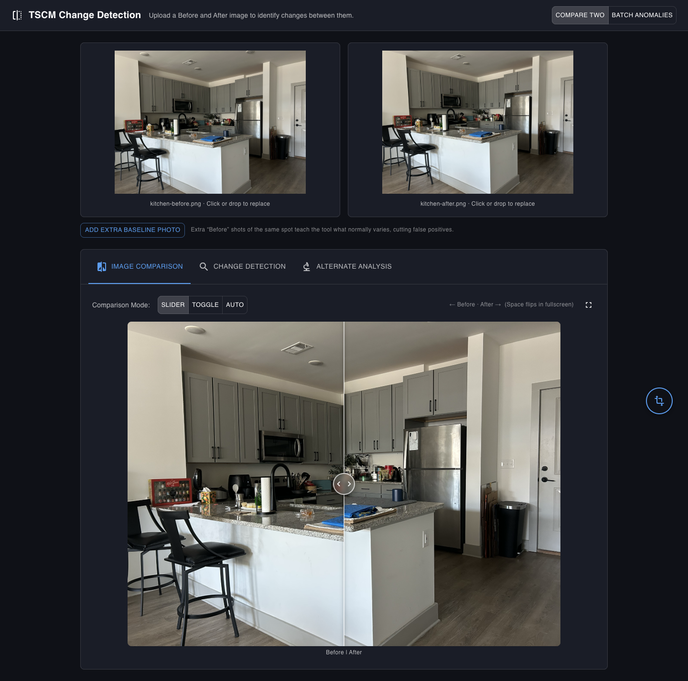
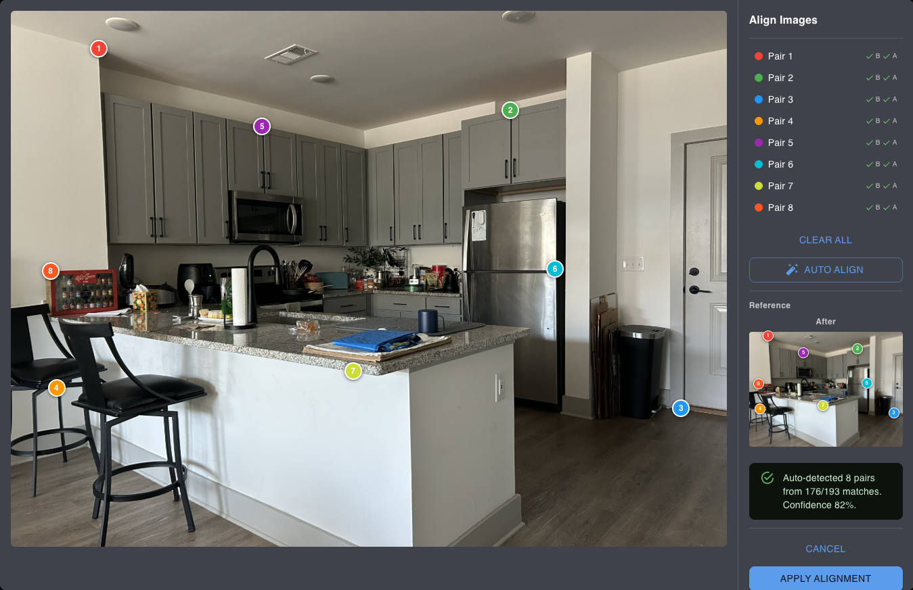
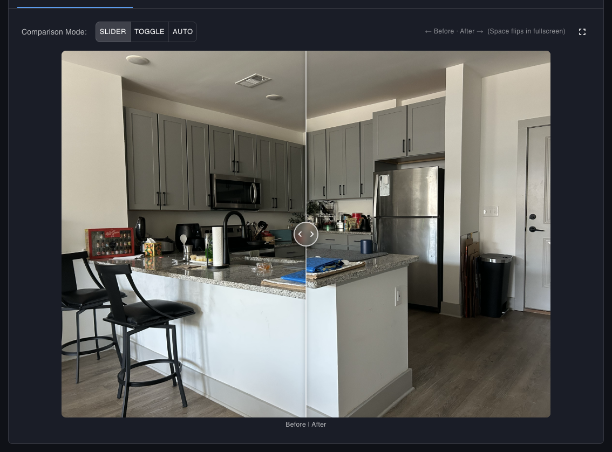
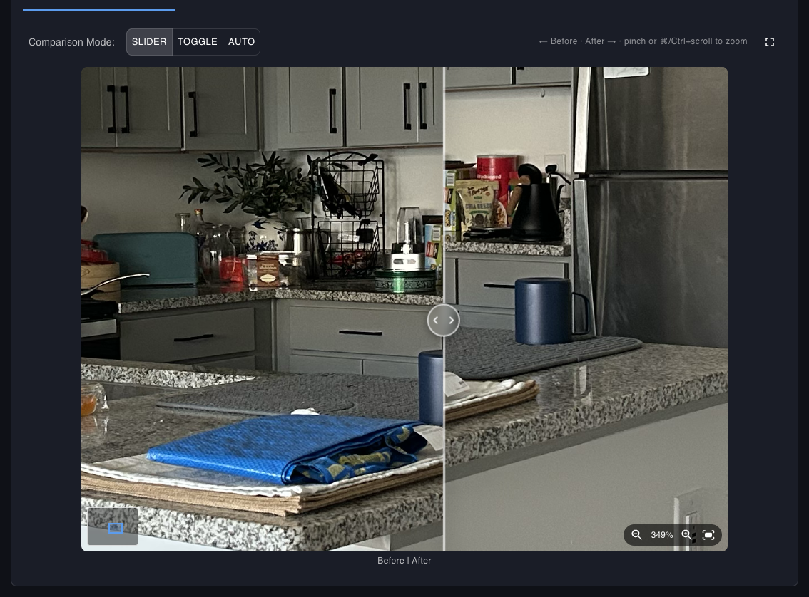
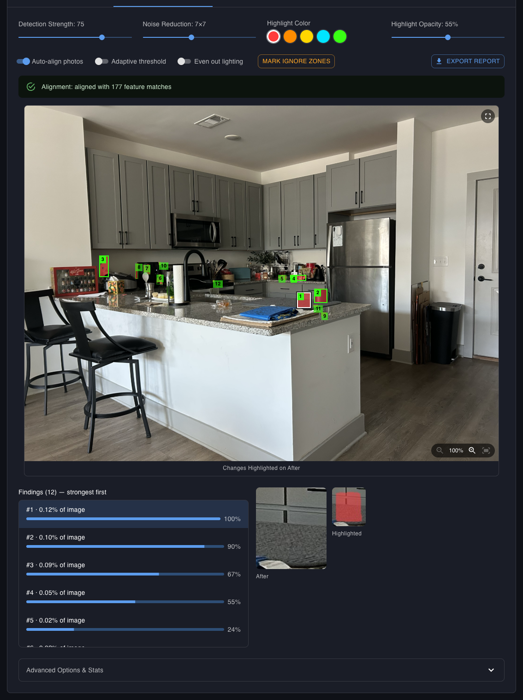
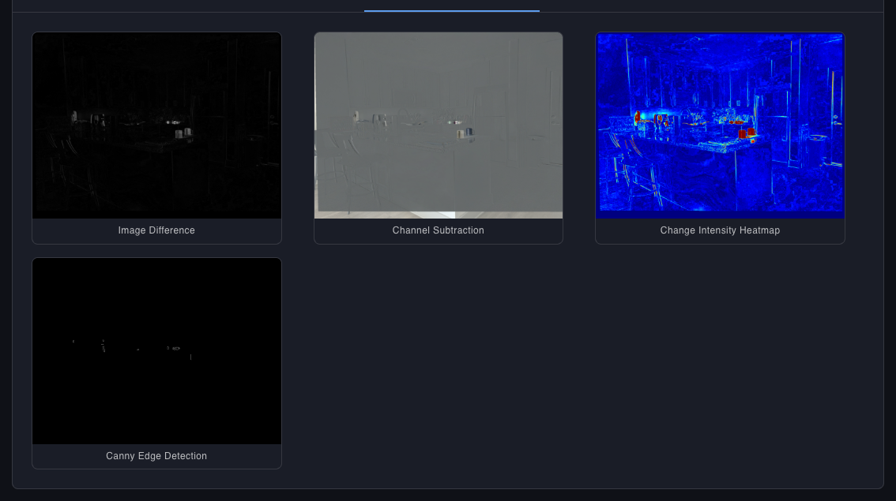
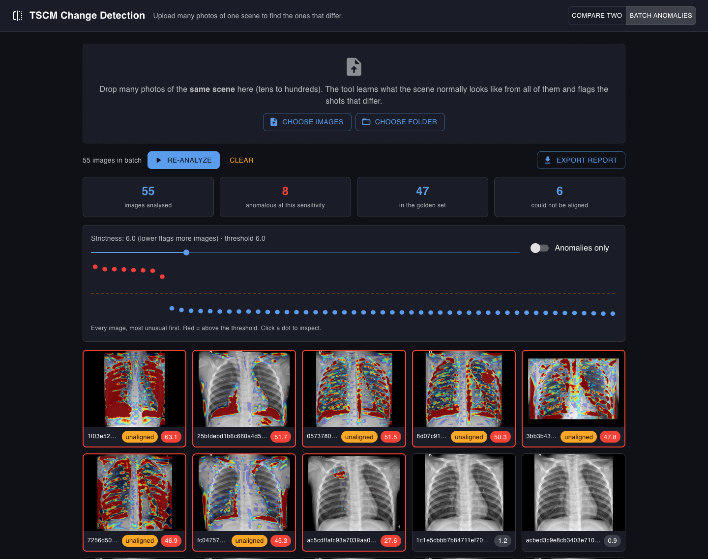
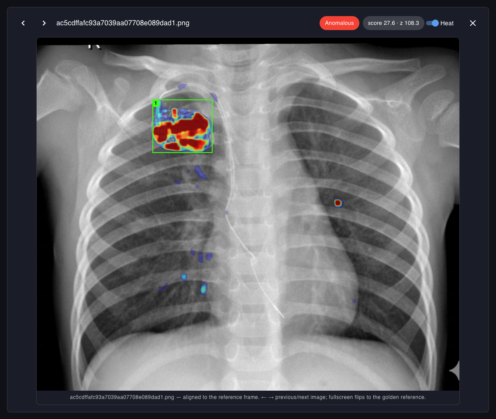

# TSCM Change Detection Analysis Tool

A web application for Technical Surveillance Countermeasures (TSCM) professionals to find what changed in a space. It works in two ways:

- **Compare two** — upload a Before and an After photo of the same spot. The tool aligns them, highlights every change, and ranks the findings.
- **Batch anomalies** — upload tens to hundreds of photos of the same scene. The tool learns what the scene normally looks like and flags the shots that differ, showing where.

Everything runs locally in a single self-contained binary; no images leave your machine.

**Stack:** Go (Gin) backend · React 19 + TypeScript frontend · MUI · Pure-Go image processing (no OpenCV)



## Installation

Download the correct release archive for your platform from the [Releases](https://github.com/skinnyrad/tscm-change-detection/releases/latest) page. No runtime dependencies required — the binary is fully self-contained.

| Platform | Architecture | File |
|---|---|---|
| Linux | x86-64 (most desktops/servers) | `tscm-change-detection_vX.X.X_linux_amd64.tar.gz` |
| Linux | ARM64 (Raspberry Pi, ARM servers) | `tscm-change-detection_vX.X.X_linux_arm64.tar.gz` |
| macOS | Apple Silicon (M1/M2/M3) | `tscm-change-detection_vX.X.X_macos_arm64.tar.gz` |
| macOS | Intel | `tscm-change-detection_vX.X.X_macos_amd64.tar.gz` |
| Windows | x86-64 | `tscm-change-detection_vX.X.X_windows_amd64.tar.gz` |
| Windows | ARM64 | `tscm-change-detection_vX.X.X_windows_arm64.tar.gz` |

Note on macOS and Windows blocking unsigned binaries

The release binaries are not code-signed or notarized. On first run, modern macOS and Windows may block the executable. Use the steps below to allow the app to run.

### macOS

```bash
tar -xzf tscm-change-detection_vX.X.X_macos_arm64.tar.gz
```

If you are unsure which chip your Mac has, click the Apple menu → **About This Mac**. Use the `arm64` build for Apple Silicon (M1 or later) and `amd64` for Intel.

- If Finder prevents launching, clear the quarantine flag then run:

```bash
xattr -d com.apple.quarantine ./tscm-change-detection
./tscm-change-detection
```

- If macOS still blocks the app, open System Settings → Privacy & Security (or System Preferences → Security & Privacy) and click "Open Anyway" next to the blocked app message. Alternatively, Control-click the app and choose "Open" to bypass Gatekeeper for that app.

Open `http://localhost:8080` in your browser.

### Windows
#### GUI Based Install
After downloading the tscm-change-detection_vX.X.X_windows_aXX64.tar.gz file, right click on it and click Extract All. Next, click the Extract button.

#### Powershell based Install
```powershell
tar -xzf tscm-change-detection_vX.X.X_windows_amd64.tar.gz
.\tscm-change-detection.exe
```

If you are on an ARM device, use the `windows_arm64` archive instead.

#### Running
Double click on the tscm-change-detection.exe file that was extracted. A command window will appear. Open `http://localhost:8080` in your browser.

If Windows Defender SmartScreen warns: click "More info" then "Run anyway". You can also right-click the downloaded file, choose Properties, and check "Unblock" at the bottom of the General tab before running.

If using PowerShell, unblock the file then run it:

```powershell
Unblock-File -Path .\tscm-change-detection.exe
.\tscm-change-detection.exe
```
Open `http://localhost:8080` in your browser.

### Linux

```bash
tar -xzf tscm-change-detection_vX.X.X_linux_amd64.tar.gz
./tscm-change-detection
```

The binary ships with the executable bit already set. Open `http://localhost:8080` in your browser.

To make the binary available system-wide, move it to a directory on your `PATH`:

```bash
sudo mv tscm-change-detection /usr/local/bin/
```

## Building from source

**Prerequisites:** [Go 1.25+](https://go.dev/dl/) · [Bun](https://bun.sh)

1. Clone the repository:

   ```bash
   git clone https://github.com/skinnyrad/tscm-change-detection.git
   cd tscm-change-detection
   ```

2. Build the frontend:

   ```bash
   cd frontend && bun install && bun run build && cd ..
   ```

3. Build the Go binary (embeds the frontend at compile time):

   ```bash
   go build -o tscm-change-detection .
   ```

4. Run:

   ```bash
   ./tscm-change-detection
   ```

The app opens at `http://localhost:8080`.

To run the tests: `go test ./...` and, in `frontend/`, `bun run typecheck && bun test`. See [AGENTS.md](AGENTS.md) for the architecture and the evaluation harnesses used to measure detection quality.

## Quick start

1. Run the binary and open `http://localhost:8080`.
2. Pick a mode with the **Compare two / Batch anomalies** switch in the top-right corner.
3. **Compare two:** drop a Before and an After photo into the two panels, then use the tabs below them.
   **Batch anomalies:** drop in a folder of photos of one scene and click **Find anomalies**.

## Compare two

### Uploading and alignment

Drop or click to upload a **Before** and an **After** image (JPG or PNG). Phone photos are rotated upright automatically from their EXIF data.

The two photos are **aligned automatically** on upload: the tool matches hundreds of features between them, fits the camera movement, rejects fits that look implausible, and corrects any remaining small shift. Hand-held photos taken from roughly the same spot therefore compare cleanly without any manual work. The result is shown at the top of the Change Detection tab (for example *"aligned with 177 feature matches"*), and it can be switched off there with **Auto-align photos**.

If the photos differ in size, Before is scaled to match After; if their shapes differ, it is scaled without stretching and the padding is ignored during analysis.

**Extra baselines.** Use **Add extra baseline photo** to upload more "Before" shots of the same spot. They are combined into a per-pixel median, and the natural variation between them (a flickering screen, a curtain that moves) is subtracted, so normally-varying areas stop triggering detections.

### Manual alignment and tie points

If automatic alignment isn't enough — for example when the camera moved a lot — click the **Transform button** (⇄, bottom-right) to open the alignment dialog. Place up to 8 matching point pairs, alternating between the Before and After images, then **Apply Alignment** to warp Before onto After. The button turns solid blue while a manual alignment is active; **Reset manual alignment** under the upload panels goes back to automatic alignment.

**Auto Align** fills in all 8 pairs for you. It picks points spread around the frame, one per region, favouring corners of stable structure — wall and ceiling junctions, cabinet and door frames — over furniture and clutter in the middle of the scene. Their After positions come from the full automatic fit, so they are accurate even where features are hard to click by hand. Review them, move any that landed on something that may have moved, and apply.



### Tab 1 — Image Comparison

Visually compare the two images. Switch between three modes:

- **Slider** — drag the divider left/right to reveal Before or After; drag the round handle vertically to inspect any part of the image.
- **Toggle** — click `Before`, `After`, or `↔` to flip between the full images instantly.
- **Auto** — flickers between Before and After at the speed set by the Speed slider (100 ms – 2 s per frame). Flicker comparison makes small changes jump out.

Press `←` to show Before and `→` to show After in any mode (flipping by hand stops Auto).

**Zoom in to inspect.** Pinch on a trackpad or touchscreen, hold `⌘`/`Ctrl` and scroll, double-click, or use the − / + buttons that appear in the bottom-right corner of the image. Drag (or scroll) to move around while zoomed; a small locator in the bottom-left shows which part of the image you're looking at. The zoomed view **stays put when you flip between Before and After or switch modes**, so you can compare the same small area in detail. In Slider mode, move the divider with its round handle while zoomed. Double-click again or press `0` to return to the whole image. The fullscreen button (top-right of the image) shows the comparison full-screen with Before/After labels; there, `Space` also flips and `Esc` exits.





### Tab 2 — Change Detection

Shows the After image with detected changes highlighted. Each change is drawn as a numbered box, ranked from strongest to weakest, and listed under the image as **Findings**. Click a finding (in the list or on the image) to see zoomed crops of that area. Results update automatically whenever a control changes.

The result zooms the same way as the comparison view (pinch, `⌘`/`Ctrl`+scroll, double-click or the − / + buttons). The zoom is kept while you adjust the controls, so you can tune the settings while watching one area. Boxes stay clickable and ignore zones can be drawn at any zoom level.



**Controls:**

- **Detection Strength (5–100, default 75)** — higher values flag subtler changes; lower values reduce false positives.
- **Noise Reduction (1–15, default 7×7)** — removes specks smaller than this before counting changes.
- **Highlight Color** and **Highlight Opacity** — how changes are drawn.
- **Auto-align photos** — automatic alignment on/off (see above).
- **Adaptive threshold** — sets the detection threshold from each pair's own noise level instead of a fixed number; Detection Strength then fine-tunes it. Useful when image quality varies. On pairs that differ almost everywhere (different season, weather or time of day) the noise level is high, so it flags only the strongest changes.
- **Even out lighting** — corrects lighting that differs across the frame (a lamp switched on, sun through a window, a moving shadow), which Match exposure can't, because it applies one correction to the whole image. Changed objects are left out of the correction so they keep their contrast, but a change covering a large part of the frame can be softened. On outdoor test sets it removed roughly a third to a half of the flagged area without costing recall on the change-detection lab.
- **Mark ignore zones** — drag rectangles over areas that legitimately change (TV and computer screens, windows, clocks). They are excluded from detection and reports. Remove one with its ×, or all with the chip that appears.
- **Export report** — saves a self-contained HTML file (open it in a browser and print to PDF) with both images, the highlighted result, every finding with a crop, the settings used, and SHA-256 hashes of both source files for chain-of-custody records.

**Advanced Options & Stats** (collapsed by default):

- **Min Region Size** — discard detections smaller than this many pixels.
- **Pre-blur (σ 0–4, default 2.0)** — smooths JPEG artifacts and slight camera shake before comparing. 0 disables it.
- **Fill Gaps (1–15, default 5×5)** — fills holes inside detected regions so objects appear as solid shapes.
- **Shift Tolerance (0–3 px)** — ignores differences explained by a pixel or two of leftover misalignment. Helps hand-held photos; at higher values very small real changes can be hidden.
- **Match exposure** (on) — corrects brightness and white-balance differences between the shots so they aren't flagged as changes.
- **Normalize lighting** — a simpler brightness correction, used when Match exposure is off.
- **Colour-aware** (on) — compares colour as well as brightness, so an object that changed colour but not brightness is still caught.
- **Stats** — changed area %, changed pixels, distinct regions, and the threshold actually used.

### Tab 3 — Alternate Analysis

Four views of the same comparison (using the same settings as Change Detection), useful for characterizing what kind of change was found:

- **Image Difference** — grayscale map of how much each pixel changed.
- **Channel Subtraction** — After − Before per colour channel; reveals colour shifts and subtle, gradual modifications.
- **Change Intensity Heatmap** — blue = little change, red = strong change; stretched so faint changes stay visible.
- **Canny Edge Detection** — outlines of the changed structures.

Open any view fullscreen and use `←`/`→` to flip through all four.

*Example: a pair of glasses was moved between the two shots (`test-images/glasses1.jpg` and `glasses2.jpg`). Each view shows both the old and the new position.*



## Batch anomalies

Use this mode when you have **many photos of the same scene** — repeated sweeps of a room, a series from a fixed camera, a set of scans — and want to find the ones that are different, without choosing a single "before".

1. Switch to **Batch anomalies** (top-right).
2. Drop in the photos, or use **Choose images** / **Choose folder**. Tens to hundreds work well (up to 1000); at least 10 is recommended.
3. Click **Find anomalies**. A progress bar shows the images being aligned; 50–100 images take a few seconds.



**Reading the results**

- **Summary** — images analysed, how many are anomalous at the current strictness, how many formed the *golden set* (the shots that agree with each other and define "normal"), and how many could not be aligned.
- **Strictness** — lower values flag more images. Moving the slider re-classifies instantly without re-running the analysis.
- **Score strip** — every image as a dot, most unusual first. The dashed line is the threshold; red dots are above it. Click any dot to inspect that image.
- **Image cards** — sorted by score. Anomalous images have a red border and a heat overlay. **unaligned** means the shot couldn't be matched to the scene (taken from somewhere else, or of a different scene), which is unusual in itself.
- **Anomalies only** hides the normal shots.

**Inspecting an image.** Click a card or dot to open the inspector: the shot aligned to the scene, with a heat overlay (toggle **Heat**) and numbered boxes around each anomalous area. Zoom in with pinch, `⌘`/`Ctrl`+scroll or double-click. Use `←`/`→` or the arrow buttons to step through images. Open it fullscreen to flip between the shot and the **golden reference** — the typical appearance of the scene, built from the golden set.



**Export report** saves a self-contained HTML report with the golden reference and each anomalous image annotated with its boxes and heat, plus the method and settings.

**How it works, briefly.** Every photo is aligned to the most typical shot and exposure-matched. The tool then computes, for every pixel, the median and normal spread across the shots that agree with each other, repeatedly dropping shots that don't. Each image is scored by its strongest area of deviation. It looks for both compact objects and thin structures such as cables and wires, and ignores blown-out highlights (lamps, glare) that vary from shot to shot. An image is flagged only if it clearly stands out from the golden set *and* the tool can point to where.

## Keyboard shortcuts

| Where | Keys | Action |
|---|---|---|
| Image Comparison | `←` / `→` | Show Before / After |
| Comparison slider (focused) | `←` `→` `↑` `↓`, `Shift`, `Home`/`End` | Move the divider and handle; bigger steps; jump to ends |
| Any fullscreen view | `←` / `→`, `Space`, `Esc` | Flip between images, flip, exit |
| Change Detection fullscreen | `←` / `→` | Cycle Before, After and the result |
| Batch inspector | `←` / `→` | Previous / next image |
| Any image (pointer over it) | `+` / `−` / `0` | Zoom in / out / reset |
| Any image | Pinch, `⌘`/`Ctrl` + scroll, double-click | Zoom (double-click again to reset) |
| Any zoomed image | Drag, or scroll | Pan |

## Best Practices

- Shoot from the **same position and height** each time; consistent lens position matters more than anything else. Automatic alignment corrects small differences, but it can't undo parallax (near objects shifting against far ones) from a large change in position.
- Keep lighting consistent where you can. Exposure and white-balance differences are corrected automatically, but moving shadows and lamps turning on or off are real visual changes.
- Take **several Before shots** of important areas and add them as extra baselines, or use Batch mode — the tool then learns what normally varies.
- Mark **ignore zones** over screens, windows and anything else that is expected to change.
- If there are too many false positives, lower Detection Strength, raise Noise Reduction or Pre-blur, or add 1 px of Shift Tolerance. If lighting changed between the sweeps, turn on Even out lighting. If real changes are missed, raise Detection Strength (and turn Adaptive threshold off).
- Detection compares appearance pixel by pixel, so it works best when both sweeps are taken from the same spots under similar lighting. Photos taken in different seasons or weather, or from noticeably different viewpoints, will show many changes that are real differences in appearance but not meaningful ones.
- When automatic alignment reports that it was rejected, use the alignment dialog: Auto Align, check the points, and apply.
- Use **Alternate Analysis** to cross-check: the heatmap shows severity, channel subtraction reveals colour changes, and the edge map shows structural outlines.
